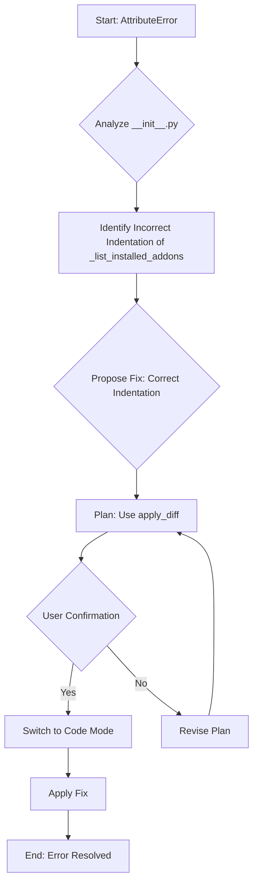

# Plan to Fix AttributeError in AsciaHomeSense Integration

## Problem

An `AttributeError: 'AsciaAddonManager' object has no attribute '_list_installed_addons'` occurs when setting up the `asciahomesense` component. The error originates from line 220 in `homeassistant/components/asciahomesense/__init__.py`.

## Analysis

Examination of `homeassistant/components/asciahomesense/__init__.py` revealed that the method `_list_installed_addons` (defined starting at line 147) is incorrectly indented. It appears nested within the `async_install_addon_alternative` method instead of being a direct method of the `AsciaAddonManager` class. This incorrect indentation prevents the method from being accessed directly on the `addon_manager` object.

## Proposed Plan

1.  **Goal:** Fix the `AttributeError` by correcting the indentation of the `_list_installed_addons` method.
2.  **Action:** Use the `apply_diff` tool to modify `homeassistant/components/asciahomesense/__init__.py`. The diff will adjust the indentation of the entire `_list_installed_addons` method block (lines 147-165) so that it aligns with the other methods of the `AsciaAddonManager` class.
3.  **Verification:** After applying the fix, the `async_setup` function should be able to call `addon_manager._list_installed_addons()` without error.

## Workflow Diagram

## Next Steps

1.  Confirm user agreement with the plan. (Completed)
2.  Save this plan to `asciahomesense_indentation_fix_plan.md`. (Current step)
3.  Switch to `code` mode to implement the fix using `apply_diff`.